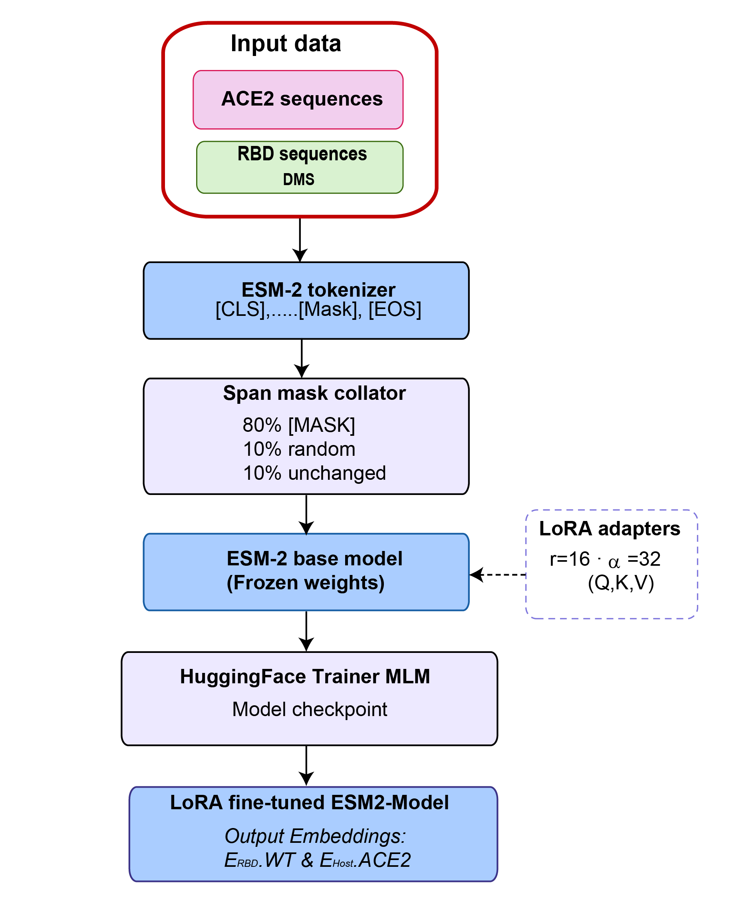
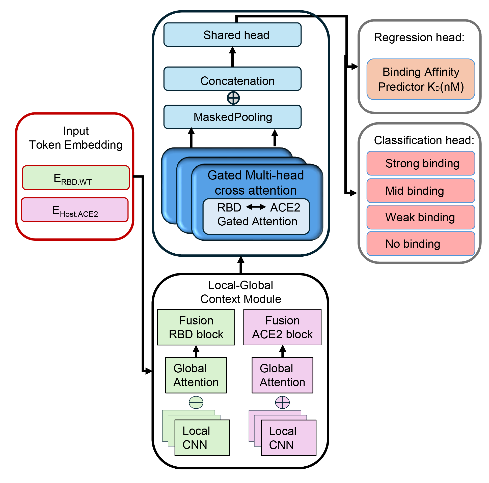

# CompatNet: SARS-CoV-2 RBD-ACE2 Binding Prediction

A deep learning framework for predicting SARS-CoV-2 RBD-ACE2 binding affinity and classification using protein language models and multi-task cross-attention neural networks.

## Overview

This pipeline predicts protein-protein interactions between the SARS-CoV-2 Receptor Binding Domain (RBD) and the ACE2 receptor. It uses a multi-task architecture that simultaneously predicts binding affinity (pKd) and binding strength classification.

The pipeline consists of three main stages:

1. **Domain Adaptation** — LoRA-based fine-tuning of ESM-2 on RBD and ACE2 protein sequences
2. **Embedding Generation** — Input embeddings produced using the fine-tuned ESM-2 model
3. **Multi-Task Training** — Joint regression and classification using cross-attention

## Architecture

The model combines:
- **Refinement Modules**: Local CNN + global attention for sequence encoding
- **Cross-Attention**: Three-level interaction modeling between RBD and ACE2
- **Multi-Task Head**: Shared representation branching into regression (pKd) and classification (4 binding strength classes)

## Model Architecture pipeline

**Stage 1 — Fine Tuning ESM-2 Model and LoRA masked-LM adaptation model**


**Stage 2 — Multi-task cross attention model architecture**


Key specifications:
- Parameters: ~20M
- Input: ESM-2 embeddings (480D, ESM-2 35M model)
- Output: pKd value + binding class probabilities

## Installation

```bash
git clone https://github.com/kritikaprasai/SARS-CoV2-RBD-ACE2-Project
cd SARS-CoV2-RBD-ACE2-Project

python -m venv venv
source venv/bin/activate  # Windows: venv\Scripts\activate

pip install -r requirements.txt
```

## Usage
## Pre-trained Models

Pre-trained model weights are available on Hugging Face and required before running inference or skipping training.

**Download:** [CompatNet on Hugging Face](https://huggingface.co/Kritika397/CompatNet/tree/main)

After downloading, place the files in the following locations:

```
CompatNet SARS RBD-ACE2 Model/
├── outputs/
│   └── models/
│       └── combined_model.pt          # Main multi-task model
│
└── runs/
    └── stage1/
        └── merged_backbone/           # Domain-adapted ESM-2 (LoRA fine-tuned)
            ├── config.json
            ├── tokenizer_config.json
            └── model.safetensors
```

### Step 1: Domain-Adapted ESM-2 Fine-Tuning

```bash
python mlm_esm2_lora.py \
    --ace2 Dataset/ACE2_sequences.fasta \
    --rbd Dataset/RBD_DMS_sequences.fasta \
    --out runs/stage1 --epochs 10
```

### Step 2: Generate Embeddings

```bash
python preprocessing.py \
    --input Dataset/data.json \
    --output Embeddings/embeddings.npz \
    --model "runs/stage0/merged_backbone" \
    --batch-size 4
```

Input format (`data.json`):

```json
[
  {
    "Sample_ID": "sample_001",
    "RBD_Sequence": "NITNLCPFGEVFNATR...",
    "ACE2_sequence": "MSSSSWLLLSLVAVTA...",
    "binding_affinity": 48.5,
    "pKd": 7.314,
    "Class_ID": 0
  }
]
```

### Step 3: Train the Model

```bash
python train_model.py \
    --data Embeddings/embeddings.npz \
    --config config.yaml
```

Output: `outputs/models/combined_model.pt`

### Step 4: Run Inference

```bash
python inference.py \
    --model outputs/models/combined_model.pt \
    --input TestDataset/test_data.json \
    --output predictions.csv
```

Output: `predictions.csv` with pKd values and class predictions

### Step 5: Evaluate

```bash
jupyter notebook Plotting_results.ipynb
```

This notebook can be used to evaluate the model on radomly selected test set and generate a full metrics summary.

## Configuration

Key parameters in `config.yaml`:

```yaml
training:
  num_folds: 3
  num_seeds: 3
  batch_size: 8
  learning_rate: 2.0e-5
  stage1_epochs: 100
  stage2_epochs: 300
  use_focal_loss: true
  use_ldam: true
```

## Pipeline Summary

| Stage | Input | Output |
|-------|-------|--------|
| Preprocessing | JSON sequences | NPZ embeddings |
| Training | NPZ embeddings | Model checkpoints |
| Inference | New sequences + model | CSV predictions |

## Project Structure

```
CompatNet SARS RBD-ACE2 Model/
├── README.md
├── requirements.txt
├── config.yaml
│
├── mlm_esm2_lora.py         # Stage 1: ESM-2 LoRA fine-tuning
├── preprocessing.py         # Stage 2: Embedding generation
├── train_model.py           # Main training script
├── inference.py             # Standalone inference
├── Plotting_results.ipynb   # Evaluation and visualization
│
├── config.py
├── model.py
├── data_utils.py
├── training.py
├── utils.py
│
├── runs/
│   └── stage1/
│       └── merged_backbone/ # Fine-tuned ESM-2 model
│
├── outputs/
│   ├── models/              # Trained model checkpoints
│   └── results/             # Logs and evaluation metrics
│
└── notebook_plots/          # Evaluation visualizations
```

## Outputs

**Training:** model checkpoints, cross-validation logs, training curves

**Inference:** `predictions.csv` with Kd (nM) and class predictions

**Evaluation:** confusion matrix, ROC curves, precision-recall curves, regression scatter plots, residual plots, and a metrics summary (R², RMSE, accuracy, macro/weighted F1, precision, recall)


## Citation

```bibtex
@article{prasai2026multitask,
  title={Interaction-aware multitask deep learning reveals cross-species receptor compatibility landscapes across sarbecoviruses},
  author={Prasai K, Chandler JC, Espada C, Wiese R, Long Y, Sean P. Streich, Heale J, Roberts N, Tao YJ, DeLiberto TJ, Wan X-F},
  journal={To be added},
  year={2026}
}
```

## License

## License

This project is distributed under the Academic Research License.
The software may be used for academic and research purposes only.  
See the [LICENSE](LICENSE) file for the complete license terms.

## Acknowledgments

- [ESM (Evolutionary Scale Modeling)](https://github.com/facebookresearch/esm) for protein language model embeddings
- [PyTorch](https://pytorch.org/) deep learning framework

## Contact

For questions or issues, please contact: kpvwx@missouri.edu
